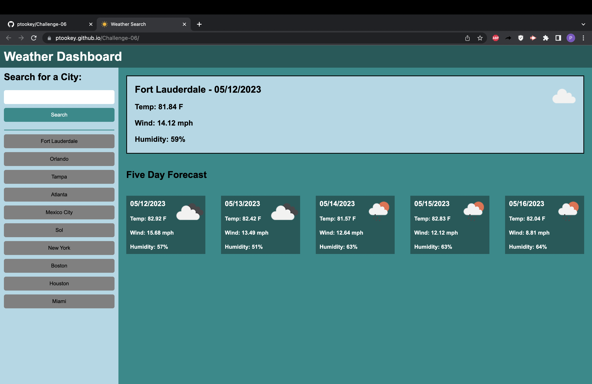

# Challenge-06

## Description

This was the sixth challenge of the bootcamp, having students construct a web app to tell the weather. While partaking in this challenge one can get very familiar with javascript. The logic puzzles used to create the project is useful and seeing how to refactor the code to make it simpler is fun as well.

## Usage

This can be used to check the weather.

## Link to Pages

[Challenge-06](https://ptookey.github.io/Challenge-06/)

## Screenshot of Page

